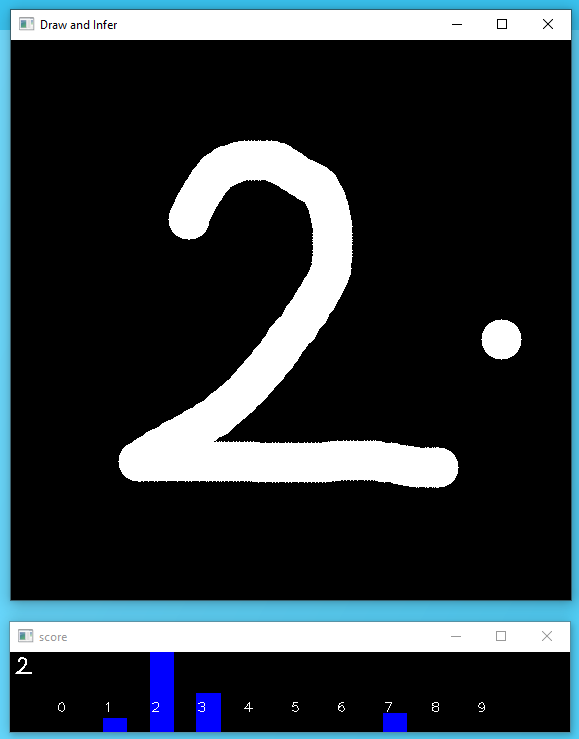

# OpenVINO simple inference demo with GNA unit  

### Description:  
The `GNA` is a kind of low-power neural network accelerator which can be found in recent Intel CPUs.  `GNA` is an abbrebiation of **Gaussian Neural-network Accelerator**. The current `GNA` unit have very limited performance and capability but it is expected to grow in the future generations.    
The DL model in this project only consists of `dense` (or `fully-connected`) layers and the output layer doesn't have `SoftMax` activation because `GNA` device doesn't support 2D convolution layers nor `softmax` activation. Due to that limitation, the model accuracy is not high but the purpose of this project is to demonstrate the **`GNA` in action**.  
Please refer to the [GNA plugin guide](https://docs.openvinotoolkit.org/latest/openvino_docs_IE_DG_supported_plugins_GNA.html) for detail.  




### Prerequisites:  
- TensorFlow 1.15  
- OpenVINO 2021.4 (2021.x may work)  


### How to train the model and create trained model files  
You can train the model by just kicking the `training.py` script. `training.py` will use `keras.datasets.mnist` as the training and validation dataset and train the model, and then save the trained model in 3 different formats, `frozen pb(.pb)`, `SavedModel`, and `Keras HDF5(.h5)`.
```sh
python3 training.py
```

### How to convert a TF trained model into OpenVINO IR model format  
  Here's the way to convert the generated models into OpenVINO IR model format using `Model Optimizer` in OpenVINO. `Model Optimizer` doesn't support HDF5 format.   

- Frozen GraphDef PB to OpenVINO IR model   

Linux  
```sh
python3 ${INTEL_OPENVINO_DIR}/deployment_tools/model_optimizer/mo.py \
  --input_model mnist-frozen.pb \
  -b 1 \
  --output_dir mnist-frozen-ir \
  --data_type FP16
```
Windows 10
```sh
python "%INTEL_OPENVINO_DIR%\deployment_tools\model_optimizer\mo.py" ^
  --input_model mnist-frozen.pb ^
  -b 1 ^
  --output_dir mnist-frozen-ir ^
  --data_type FP16
```

- SavedModel to OpenVINO IR model  

```sh
python3 ${INTEL_CVSDK_DIR}/deployment_tools/model_optimizer/mo.py \
  --saved_model_dir saved-model \
  -b 1 \
  --output_dir savedmodel-ir \
  --data_type FP16
```

### How to infer with OpenVINO  
By default, `infer.py` will use `./mnist-frozen-ir/mnist-frozen.xml` IR model to infer.  
```sh
python3 infer.py
```

### How to run `draw-and-infer.py` demo program  
Here's a simple yet bit fun demo application for MNIST. You can draw number on the screen by mouse or finger-tip and you'll see the real-time inference result.  Right-click will clear the screen for another try. This demo is also using OpenVINO and GNA for inferencing.  
By default, `draw-and-infer.py` will use `./mnist-frozen-ir/mnist-frozen.xml` IR model to infer.  
```sh
python3 draw-and-infer.py
```
